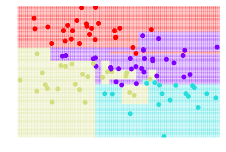

# Aritificial Intelligence, Machine Learning, and Deep Learning

Reiser Wang 

https://github.com/reiserwang/data-science-ipython-notebooks


<p></p>

*[image source](https://camo.githubusercontent.com/53bf6c54a8b70732f8fc8663807e6285cb281bd8/687474703a2f2f7363696b69742d6c6561726e2e6f72672f6465762f5f7374617469632f6d6c5f6d61702e706e67)*


# Fundamentals on Machine Leanring

## The Model Approach
1. Import the model to use.
2. Training the model on the data and storing information learned from data.
3. Predict lables for the new data
4. Measuring model performance

## Logistic Regression
<p>In statistics, the logistic model (or logit model) is a statistical model that is usually taken to apply to a binary dependent variable. In regression analysis, logistic regression or logit regression is estimating the parameters of a logistic model. More formally, a logistic model is one where the log-odds of the probability of an event is a linear combination of independent or predictor variables. The two possible dependent variable values are often labelled as "0" and "1", which represent outcomes such as pass/fail, win/lose, alive/dead or healthy/sick. The binary logistic regression model can be generalized to more than two levels of the dependent variable: categorical outputs with more than two values are modelled by multinomial logistic regression, and if the multiple categories are ordered, by ordinal logistic regression, for example the proportional odds ordinal logistic model. 
<p>Logistic regression is used in various fields, including machine learning, most medical fields, and social sciences.

*[Souce: Wikipedia](https://en.wikipedia.org/wiki/Logistic_regression)*

### Showing Built-In Digits Datasets
```python
from sklearn.datasets import load_digits
digits = load_digits()
import numpy as np 
import matplotlib.pyplot as plt
plt.figure(figsize=(20,4))
for index, (image, label) in enumerate(zip(digits.data[0:5], digits.target[0:5])):
 plt.subplot(1, 5, index + 1)
 plt.imshow(np.reshape(image, (8,8)), cmap=plt.cm.gray)
 plt.title('Training: %i\n' % label, fontsize = 20)
plt.show()

```
### Spliting Data into Training and Test Sets
```python
from sklearn.model_selection import train_test_split
x_train, x_test, y_train, y_test = train_test_split(digits.data, digits.target, test_size=0.25, random_state=0)
```

### Modeling Pattern
```python
'''Import the model to use'''
from sklearn.linear_model import LogisticRegression

'''Make a model isntance'''
logisticRegr = LogisticRegression()

'''Traning the model on the data and storing information learned from data'''
logisticRegr.fit(x_train, y_train)

'''Predict labels for the new data'''
predictions = logisticRegr.predict(x_test)

'''Measuring Model Performance'''
score = logisticRegr.score(x_test, y_test)
print(score)
```
> 0.953333333333

```
score_set={}
for trainsize in range (1,100,1):
    x_train, x_test, y_train, y_test = train_test_split(digits.data, digits.target, test_size=(100-trainsize)/100, random_state=0)
    logisticRegr.fit(x_train,y_train)
    score_set[trainsize]=score = logisticRegr.score(x_test, y_test)
    
plt.plot(score_set.keys(),score_set.values())

plt.ylabel("score")
plt.xlabel("training set size %") 
plt.title(r'logisticRegr Score')
plt.show()
```
<p> 

<p>


[scikit - logistic regression](http://scikit-learn.org/stable/modules/generated/sklearn.linear_model.LogisticRegression.html)

## K-Means Clustering
k-means clustering is a method of vector quantization, originally from signal processing, that is popular for cluster analysis in data mining. k-means clustering aims to partition n observations into k clusters in which each observation belongs to the cluster with the nearest mean, serving as a prototype of the cluster. This results in a partitioning of the data space into Voronoi cells.

The problem is computationally difficult (NP-hard); however, there are efficient heuristic algorithms that are commonly employed and converge quickly to a local optimum. These are usually similar to the expectation-maximization algorithm for mixtures of Gaussian distributions via an iterative refinement approach employed by both k-means and Gaussian mixture modeling. Additionally, they both use cluster centers to model the data; however, k-means clustering tends to find clusters of comparable spatial extent, while the expectation-maximization mechanism allows clusters to have different shapes.

*[Source:Wikipedia](https://en.wikipedia.org/wiki/K-means_clustering)*


``` python
from sklearn.cluster import KMeans
k_means = KMeans(n_clusters=3, random_state=0) # Fixing the RNG in kmeans
k_means.fit(X)
y_pred = k_means.predict(X)

plt.scatter(X_reduced[:, 0], X_reduced[:, 1], c=y_pred,
           cmap='rainbow');

plt.show()
```

``` python
from sklearn.datasets.samples_generator import make_blobs
X, y = make_blobs(n_samples=1000, centers=4,
                  random_state=0, cluster_std=1.20)
plt.scatter(X[:, 0], X[:, 1], s=50);
plt.show();
```

<p> 

```python
from sklearn.cluster import KMeans
est = KMeans(4)  # 4 clusters
est.fit(X)
y_kmeans = est.predict(X)
plt.scatter(X[:, 0], X[:, 1], c=y_kmeans, s=20, cmap='rainbow');plt.show()
```

<p> 


## Random Forests Clustering
<p> *[source](https://i2.kknews.cc/SIG=1akj8kp/s76000608p37242005r.jpg)* </p>

Random frests or random decision forests are an ensemble learning method for classification, regression and other tasks, that operate by constructing a multitude of decision trees at training time and outputting the class that is the mode of the classes (classification) or mean prediction (regression) of the individual trees. Random decision forests correct for decision trees' habit of overfitting to their training set. 

*[Source: Wikipedia](https://en.wikipedia.org/wiki/Random_forest)*


[scikit - random forest classifier](http://scikit-learn.org/stable/modules/generated/sklearn.ensemble.RandomForestClassifier.html)

``` python
from sklearn.tree import DecisionTreeClassifier
import numpy as np

clf = DecisionTreeClassifier()

plt.figure()
visualize_tree(clf, X[:100], y[:100], boundaries=False)
plt.figure()
score=clf.score(X[:-500],y[:-500])
print("score=",score)
```
<p> 

> score= 0.858

``` python
from sklearn.tree import DecisionTreeClassifier
import numpy as np

'''
http://scikit-learn.org/stable/modules/generated/sklearn.tree.DecisionTreeClassifier.html

'''
from sklearn.model_selection import train_test_split
score_set={}
for testsize in range (1,100,1):
    clf = DecisionTreeClassifier()
    x_train, x_test, y_train, y_test = train_test_split(X, y, test_size=testsize/100, random_state=0)
    clf.fit(x_train,y_train)
    score_set[testsize]=score = clf.score(x_test, y_test)
    
plt.plot(score_set.keys(),score_set.values())

plt.ylabel("score")
plt.xlabel("training set size %") 
plt.title(r'Random Forest Classfication Score')
```

<p>


### Bagging (bootstrap aggregating)

### Boosting 


## Gradient Boosted Machines (GBM)
Gradient boosting is a machine learning technique for regression and classification problems, which produces a prediction model in the form of an ensemble of weak prediction models, typically decision trees. It builds the model in a stage-wise fashion like other boosting methods do, and it generalizes them by allowing optimization of an arbitrary differentiable loss function.

[scikit - Gradient Boosting Classifier](http://scikit-learn.org/stable/modules/generated/sklearn.ensemble.GradientBoostingClassifier.html)

> ** To-Do: add sample codes here **

## Convolutional neuro network (CNN)
<p align="center"></p>

* Types of Neural Networks
<p></p>


* [Convolutional Neural Networks for Visual Recognition](http://cs231n.github.io/convolutional-networks/)

## RNN (Recurrent Neural Network)

# Deep Learning Frameworks

## 1. TensorFlow
* Low-level core (C++/CUDA)
* Simple Python API to define he computational graph
* High-level API's (TF-Learn, TF-Slim, Keras)
* (+)  Auto differentiation - easy multi-GPU/multi-node
* (+) Active on Github. Lot's of new APIs
> [Tensorflow Tutorials](README.md#tensor-flow-tutorials)
> [Tensorflow Playground](htttp://playground.tensorflow.org)

## 2. Theano
## 3. Keras
* (+) Easy-to-use Python library that wraps Theano and Tensorflow.
* (+) Libraries, tools and Google official support
* (-) Less flexible and less projects (as of current than caffe).
* (-) Multi-GPU not working 100%
* (-) No RBM
> [Keras tutorials](README.md#keras-tutorials)

## 4. Torch
## 5. Caffe
* Applications in machine learning, vision, speech, and multimedia.
* Good for feed-forward networks and image processing.
* Widely acceptable from research communities.
* Good Python and MATLAB interfaces
* Excellent ConvNet implementation
* (-) Not intended for applications such as text, sound, or time series data
* (-) No auto-differentiation
* Not good for RNN, mainly CNN
* (-) Cubersome for big networks (GooLeNet, ResNet)

## Conclusions
* You're a PhD student on DL --> **TensorFlow**, **Theano**, **Torch**
* You awant to use DL only to get deatures --> **Keras**, **Caffe**
* You work in industry --> **TensorFlow**, **Caffe**
* You want to give pracrice works to your students --> **Keras**, **Caffe**
* You're curuous about deep learning --> **Caffe**
* You don't even know python --> **Keras**, **Torch**

## Applications
* **Computer Vision** - distill information from images ot video, face recognition, content moderator, emotion detection, etc.


## References
* [Deep learning framework](https://project.inria.fr/deeplearning/files/2016/05/DLFrameworks.pdf), Vucky K, Stephane L., et al.
* [NVIDIA Deep Learning](https://developer.nvidia.com/deep-learning)
* [Microsoft Cognittive Toolkit](https://www.microsoft.com/en-us/cognitive-toolkit/)
* [Deep Learning on AWS](https://aws.amazon.com/tw/deep-learning/)

