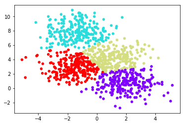
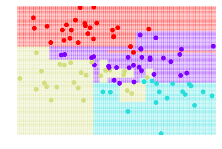

# Aritificial Intelligence, Machine Learning, and Deep Learning
<p></p>

# Fundamentals on Machine Leanring

## Logistic Regression
<p>

[scikit - logistic regression](http://scikit-learn.org/stable/modules/generated/sklearn.linear_model.LogisticRegression.html)


``` python
from sklearn.cluster import KMeans
k_means = KMeans(n_clusters=3, random_state=0) # Fixing the RNG in kmeans
k_means.fit(X)
y_pred = k_means.predict(X)

plt.scatter(X_reduced[:, 0], X_reduced[:, 1], c=y_pred,
           cmap='rainbow');

plt.show();
```

``` python
from sklearn.datasets.samples_generator import make_blobs
X, y = make_blobs(n_samples=1000, centers=4,
                  random_state=0, cluster_std=1.20)
plt.scatter(X[:, 0], X[:, 1], s=50);
plt.show();
```
<p> 
```python
from sklearn.cluster import KMeans
est = KMeans(4)  # 4 clusters
est.fit(X)
y_kmeans = est.predict(X)
plt.scatter(X[:, 0], X[:, 1], c=y_kmeans, s=20, cmap='rainbow');
plt.show();
```
<p> 


## Random Forest
<p></p>
[scikit - random forest classifier](http://scikit-learn.org/stable/modules/generated/sklearn.ensemble.RandomForestClassifier.html)

``` python
from sklearn.tree import DecisionTreeClassifier
import numpy as np

clf = DecisionTreeClassifier()

plt.figure()
visualize_tree(clf, X[:100], y[:100], boundaries=False)
plt.figure()
score=clf.score(X[:-500],y[:-500])
print("score=",score)
```
<p> 
Output:
> score= 0.858

``` python
visualize_tree(clf, X[-100:], y[-100:], boundaries=False)
plt.show();
score=clf.score(X[:500],y[:500])
print("score=",score)
```
<p> 
Output:
> score= 0.766

### Bagging (bootstrap aggregating)
### Boosting 


## Gradient Boosted Machines (GBM)
Gradient boosting is a machine learning technique for regression and classification problems, which produces a prediction model in the form of an ensemble of weak prediction models, typically decision trees. It builds the model in a stage-wise fashion like other boosting methods do, and it generalizes them by allowing optimization of an arbitrary differentiable loss function.

[scikit - Gradient Boosting Classifier](http://scikit-learn.org/stable/modules/generated/sklearn.ensemble.GradientBoostingClassifier.html)


## Convolutional neuro network (CNN)
<p></p>

* Types of Neural Networks
<p></p>


* [Convolutional Neural Networks for Visual Recognition](http://cs231n.github.io/convolutional-networks/)

## RNN (Recurrent Neural Network)

# Deep Learning Frameworks

## 1. TensorFlow
* Low-level core (C++/CUDA)
* Simple Python API to define he computational graph
* High-level API's (TF-Learn, TF-Slim, Keras)
* (+)  Auto differentiation - easy multi-GPU/multi-node
* (+) Active on Github. Lot's of new APIs
> [Tensorflow Tutorials](README.md#tensor-flow-tutorials)
> [Tensorflow Playground](htttp://playground.tensorflow.org)

## 2. Theano
## 3. Keras
* (+) Easy-to-use Python library that wraps Theano and Tensorflow.
* (+) Libraries, tools and Google official support
* (-) Less flexible and less projects (as of current than caffe).
* (-) Multi-GPU not working 100%
* (-) No RBM
> [Keras tutorials](README.md#keras-tutorials)

## 4. Torch
## 5. Caffe
* Applications in machine learning, vision, speech, and multimedia.
* Good for feed-forward networks and image processing.
* Widely acceptable from research communities.
* Good Python and MATLAB interfaces
* Excellent ConvNet implementation
* (-) Not intended for applications such as text, sound, or time series data
* (-) No auto-differentiation
* Not good for RNN, mainly CNN
* (-) Cubersome for big networks (GooLeNet, ResNet)

## Conclusions
* You're a PhD student on DL --> **TensorFlow**, **Theano**, **Torch**
* You awant to use DL only to get deatures --> **Keras**, **Caffe**
* You work in industry --> **TensorFlow**, **Caffe**
* You want to give pracrice works to your students --> **Keras**, **Caffe**
* You're curuous about deep learning --> **Caffe**
* You don't even know python --> **Keras**, **Torch**

## Applications
* **Computer Vision** - distill information from images ot video, face recognition, content moderator, emotion detection, etc.


## References
* [Deep learning framework](https://project.inria.fr/deeplearning/files/2016/05/DLFrameworks.pdf), Vucky K, Stephane L., et al.
* [NVIDIA Deep Learning](https://developer.nvidia.com/deep-learning)
* [Microsoft Cognittive Toolkit](https://www.microsoft.com/en-us/cognitive-toolkit/)
* [Deep Learning on AWS](https://aws.amazon.com/tw/deep-learning/)

