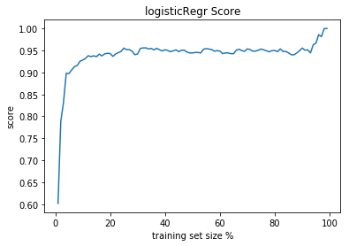
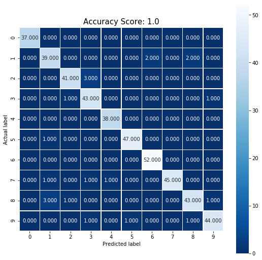
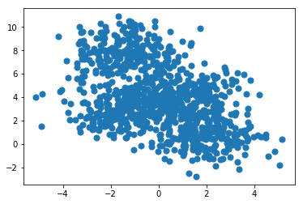
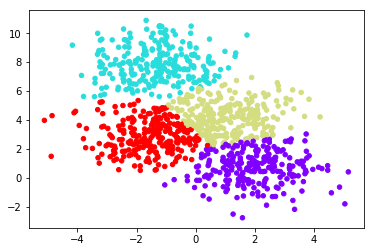
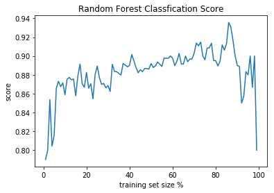

# Aritificial Intelligence, Machine Learning, and Deep Learning from Data Science

Reiser Wang 

https://github.com/reiserwang/data-science-ipython-notebooks


<p></p>

*[image source](https://camo.githubusercontent.com/53bf6c54a8b70732f8fc8663807e6285cb281bd8/687474703a2f2f7363696b69742d6c6561726e2e6f72672f6465762f5f7374617469632f6d6c5f6d61702e706e67)*

# Preface

*Artificial intelligence can ‘evolve’ to solve problems.*

*As artificial intelligence technologies advance, so does the definition of which techniques constitute AI. *

This is a quick introduction to [Data Science IPyone Notebook]( https://github.com/donnemartin/data-science-ipython-notebooks) by @tuanavu @donnemartin at Github that provides comprehensive materials to most of state-of-art tool sets in topics of deep learning. Before jumping into details, this is a quick summary and overview for those who are new to AI, machines learning, and deep learning (with simple Python-based code snippets to help explain those topics... but you don'y really need to be a Python expert). Tihs material is also for my speech to MBA student seminiar in spring 2018 helping them looking deeper into the emerging technology (or _buzzwords_). I casted a question to those MBA students: _"As computer scientists are more interested in the problems they are familiar with (e.g. video and iamge) in machine learning, what are the problems in business or social science domain that those deep learning technology may be helpful?"_.  

That would be very intneresting (and more practical ) problems to solve. And remember - AI/ML is about solving a problem in new way tht people didn't think of. If it succeeded human (like AlphaGo), it casts lights to we human beings to think about the problem from a new perspective - instead of the scary Hollywood movies.

<p>
~Source: McKinsey&Company~


# Fundamentals on Machine Leanring

## The Model Approach
1. Import the model to use.
2. Training the model on the data and storing information learned from data.
3. Predict lables for the new data
4. Measuring model performance

## Logistic Regression
<p>In statistics, the logistic model (or logit model) is a statistical model that is usually taken to apply to a binary dependent variable. In regression analysis, logistic regression or logit regression is estimating the parameters of a logistic model. More formally, a logistic model is one where the log-odds of the probability of an event is a linear combination of independent or predictor variables. The two possible dependent variable values are often labelled as "0" and "1", which represent outcomes such as pass/fail, win/lose, alive/dead or healthy/sick. The binary logistic regression model can be generalized to more than two levels of the dependent variable: categorical outputs with more than two values are modelled by multinomial logistic regression, and if the multiple categories are ordered, by ordinal logistic regression, for example the proportional odds ordinal logistic model. 
<p>Logistic regression is used in various fields, including machine learning, most medical fields, and social sciences.

*[Souce: Wikipedia](https://en.wikipedia.org/wiki/Logistic_regression)*

### Showing Built-In Digits Datasets

<p> 

<p>


### Confusion Matrix

In the field of machine learning and specifically the problem of statistical classification, a confusion matrix, also known as an error matrix,is a specific table layout that allows visualization of the performance of an algorithm, typically a supervised learning one (in unsupervised learning it is usually called a matching matrix). Each row of the matrix represents the instances in a predicted class while each column represents the instances in an actual class (or vice versa).The name stems from the fact that it makes it easy to see if the system is confusing two classes (i.e. commonly mislabeling one as another).

1. true positive (TP) eqv. with hit
2. true negative (TN) eqv. with correct rejection
3. false positive (FP) eqv. with false alarm, Type I error
4. false negative (FN) eqv. with miss, Type II error

*[Source: Wikipedia](https://en.wikipedia.org/wiki/Confusion_matrix)*

 There are two python packages (**Seaborn** and **Matplotlib**) for making confusion matrices.


#### Seaborn


<p>

#### Matplotlib

<p> 

```python
from sklearn.cluster import KMeans
est = KMeans(4)  # 4 clusters
est.fit(X)
y_kmeans = est.predict(X)
plt.scatter(X[:, 0], X[:, 1], c=y_kmeans, s=20, cmap='rainbow');plt.show()
```

<p> 


## Random Forests Clustering
<p> *[source](https://i2.kknews.cc/SIG=1akj8kp/s76000608p37242005r.jpg)* </p>

Random frests or random decision forests are an ensemble learning method for classification, regression and other tasks, that operate by constructing a multitude of decision trees at training time and outputting the class that is the mode of the classes (classification) or mean prediction (regression) of the individual trees. Random decision forests correct for decision trees' habit of overfitting to their training set. 

*[Source: Wikipedia](https://en.wikipedia.org/wiki/Random_forest)*

[scikit - random forest classifier](http://scikit-learn.org/stable/modules/generated/sklearn.ensemble.RandomForestClassifier.html)

<p>

### [Lab 2 - K-Means and Random Forest](/lab/Lab%202%20-%20K-Means%20and%20Random%20Forest.ipynb)

### Bagging (bootstrap aggregating)


## Gradient Boosted Machines (GBM)
Gradient boosting is a machine learning technique for regression and classification problems, which produces a prediction model in the form of an ensemble of weak prediction models, typically decision trees. It builds the model in a stage-wise fashion like other boosting methods do, and it generalizes them by allowing optimization of an arbitrary differentiable loss function.

> **Boosting** is a sequential technique which works on the principle of ensemble. It combines a set of weak learners and delivers improved prediction accuracy. At any instant t, the model outcomes are weighed based on the outcomes of previous instant t-1. The outcomes predicted correctly are given a lower weight and the ones miss-classified are weighted higher. This technique is followed for a classification problem while a similar technique is used for regression.

The overall GBM parameters can be divided into 3 categories:

1. Tree-Specific Parameters: These affect each individual tree in the model.
2. Boosting Parameters: These affect the boosting operation in the model.
3. Miscellaneous Parameters: Other parameters for overall functioning.

## Gradient Boosting Classification


### [Lab - Gradient Boosting](/lab/Gradient%20Boosting.ipynb)

[scikit - Gradient Boosting Classifier](http://scikit-learn.org/stable/modules/generated/sklearn.ensemble.GradientBoostingClassifier.html)


# Neuro Network

<p align="center"></p>

* Types of Neural Networks
<p></p>


* [Convolutional Neural Networks for Visual Recognition](http://cs231n.github.io/convolutional-networks/)

## Feed Forward Neural Networks
 The simplest type of artificial neural network. In this architecture, information moves in only one direction, forward, from the input layer, through the “hidden” layers, to the output layer. There are no loops in the network. The first single-neuron network was proposed already in 1958 by AI pioneer Frank Rosenblatt. While the idea is not new, advances in computing power, training algorithms, and available data led to higher levels of performance than previously possible.

## Convolutional Neural Networks (CNN)
<p>
*Source: Wikimedia*
Artificial neural networks in which the connections between neural layers are inspired by the organization of the animal visual cortex, the portion of the brain that processes images, well suited for perceptual tasks.


## RNN (Recurrent Neuro Networks)
Artificial neural networks whose connections between neurons include loops, well-suited for processing sequences of inputs. In November 2016, Oxford University researchers reported that a system based on recurrent neural networks (and convolutional neural networks) had achieved 95 percent accuracy in reading lips, outperforming experienced human lip readers, who tested at 52 percent accuracy.

# Deep Learning Frameworks

## 1. TensorFlow
* Low-level core (C++/CUDA)
* Simple Python API to define he computational graph
* High-level API's (TF-Learn, TF-Slim, Keras)
* (+)  Auto differentiation - easy multi-GPU/multi-node
* (+) Active on Github. Lot's of new APIs

> [Setup Tensorflow](https://www.tensorflow.org/install/)
> Intall [Anaconda](https://www.anaconda.com/download/) with Python (Python 3.6 recommended)
> conda update conda
> conda update anaconda
> conda create -n tensorflow python=3 anaconda
> activate tensorflow
> python install tensorflow
http://darren1231.pixnet.net/blog/post/341911221-tensorflow_windows_setup

### [Lab 3 - Tensorflow Setup](/lab/Lab%203%20-%20Tensorflow%20Setup.ipynb)

> [Tensorflow Tutorials](README.md#tensor-flow-tutorials)
> [Tensorflow Playground](htttp://playground.tensorflow.org)
> [Tensorflow Hub](https://www.tensorflow.org/hub/) - Library for reusable machine learning modules
> >[Image Recognition](piphttps://www.tensorflow.org/tutorials/image_recognition) and [Retrain an Image Classifier](https://www.tensorflow.org/tutorials/image_retraining)
> [Convolutional Neural Networks](https://www.tensorflow.org/tutorials/deep_cnn)

<<<<<<< HEAD
### [Lab 4 - Tensorflow Hub - using machine learning moules](/lab/Lab%204%20-%20Tensorflow%20Hub%20-%20using%20machine%20learning%20moules.ipynb)
=======
###  Distributed TensorFlow
https://www.tensorflow.org/deploy/distributed


### TensorFlow.js
https://js.tensorflow.org/
A JavaScript library for training and deploying ML models in the browser and on Node.js


### TensorFlow Lite
https://www.tensorflow.org/mobile/tflite/
TensorFlow Lite is TensorFlow’s lightweight solution for mobile and embedded devices. It enables on-device machine learning inference with low latency and a small binary size. TensorFlow Lite also supports hardware acceleration with the Android Neural Networks API.

>>>>>>> 3252c8044f9581e05a304b4d771dfbd285518f20


## 2. Theano
## 3. Keras
* (+) Easy-to-use Python library that wraps Theano and Tensorflow.
* (+) Libraries, tools and Google official support
* (-) Less flexible and less projects (as of current than caffe).
* (-) Multi-GPU not working 100%
* (-) No RBM
> [Keras tutorials](README.md#keras-tutorials)

## 4. Torch
## 5. Caffe
* Applications in machine learning, vision, speech, and multimedia.
* Good for feed-forward networks and image processing.
* Widely acceptable from research communities.
* Good Python and MATLAB interfaces
* Excellent ConvNet implementation
* (-) Not intended for applications such as text, sound, or time series data
* (-) No auto-differentiation
* Not good for RNN, mainly CNN
* (-) Cubersome for big networks (GooLeNet, ResNet)

## Conclusions
* You're a PhD student on DL --> **TensorFlow**, **Theano**, **Torch**
* You awant to use DL only to get features --> **Keras**, **Caffe**
* You work in industry --> **TensorFlow**, **Caffe**
* You want to give pracrice works to your students --> **Keras**, **Caffe**
* You're curious about deep learning --> **Caffe**
* You don't even know python --> **Keras**, **Torch**

## Oooray! You may now deep dive into [specific sections](https://github.com/reiserwang/data-science-ipython-notebooks/blob/master/README.md).


## References

### Frameworks
* [Deep learning framework](https://project.inria.fr/deeplearning/files/2016/05/DLFrameworks.pdf), Vucky K, Stephane L., et al.
* [NVIDIA Deep Learning](https://developer.nvidia.com/deep-learning)
* [Microsoft Cognittive Toolkit](https://www.microsoft.com/en-us/cognitive-toolkit/)
* [Deep Learning on AWS](https://aws.amazon.com/tw/deep-learning/)

### Applications

<p>

<p>


* **Computer Vision** - distill information from images ot video, face recognition, content moderator, emotion detection, etc.
* **Natural Language Processing (NLP)** - concerned with the interactions between computers and human (natural) languages, in particular how to program computers to process and analyze large amounts of natural language data. Challenges in natural language processing frequently involve speech recognition, natural language understanding, and natural language generation.
    * [Natural Laguage Toolkit](http://www.nltk.org)
    * [gensim](http://radimrehurek.com/gensim)

* **Network Analysis** - this is interesting becuase it's not just intended to "computer network", it could applies perfectly to [social science](https://cambridge-intelligence.com/keylines-faqs-social-network-analysis/) (e.g. my Linkedin connection efficiency, or Facebook connection analysis) or online advertisements (e.g. casting advertisement to a group of people in network, and analyze the efficiency and catelyst effects).  
    * [NetworkX](http://networkx.github.io)
    * [Gephi](http://gephi.github.io)


### Business Application
* [6 Examples of AI in Business Intelligence Applications](https://www.techemergence.com/ai-in-business-intelligence-applications/)
* [Machine Learning in Finance – Present and Future Applications](https://www.techemergence.com/machine-learning-in-finance/)
* [Notes from the AI frontier: Applications and value of deep learning](https://www.mckinsey.com/featured-insights/artificial-intelligence/notes-from-the-ai-frontier-applications-and-value-of-deep-learning?cid=other-eml-ttn-mip-mck-oth-1806&hlkid=d94b55c44cfb4258b7dc49f328629182&hctky=2823580&hdpid=81ba10a7-367d-45eb-96ab-f35ebad887ec)


### Others
* [Google DeepMind's AlphaGo: How it works](https://www.tastehit.com/blog/google-deepmind-alphago-how-it-works/)
<p img src="https://1.bp.blogspot.com/-b0FdTQ5Jeng/VwTeKVEuQxI/AAAAAAAAAGE/ZPAwqoT3EYU639YXhprEl-oRHKeg3xd1w/s1600/AlphaGoNetworksOverviewWithGoBoard.jpg"/>

[Source](http://deeplearningskysthelimit.blogspot.com/2016/04/part-2-alphago-under-magnifying-glass.html)
