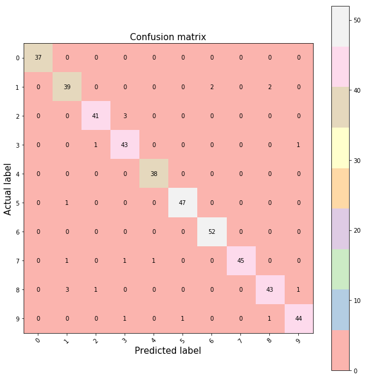
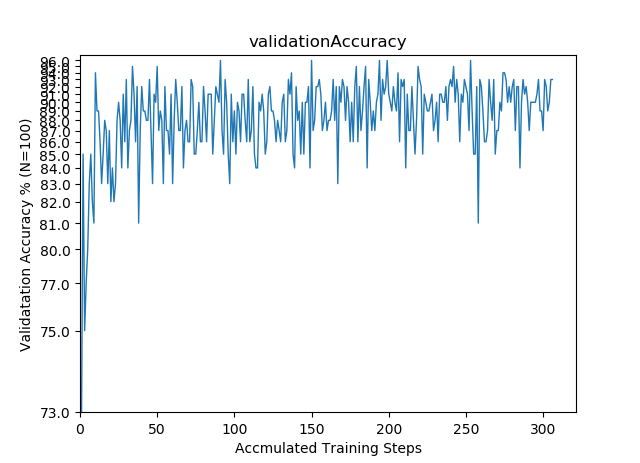
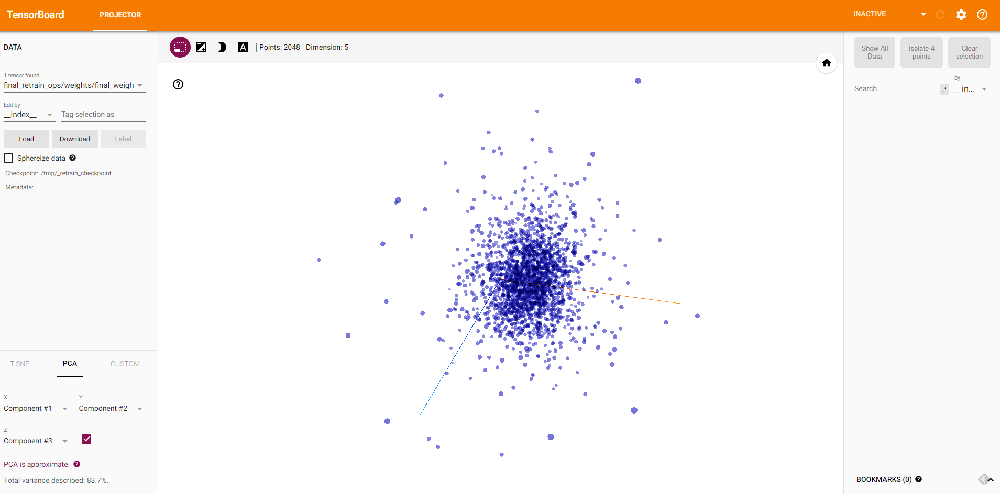

Aritificial Intelligence, Machine Learning, and Deep Learning from Data Science
===

Reiser Wang

https://github.com/reiserwang/data-science-ipython-notebooks


<p></p>

[image source](https://camo.githubusercontent.com/53bf6c54a8b70732f8fc8663807e6285cb281bd8/687474703a2f2f7363696b69742d6c6561726e2e6f72672f6465762f5f7374617469632f6d6c5f6d61702e706e67)

===
# Table of Contents
- [Aritificial Intelligence, Machine Learning, and Deep Learning from Data Science](#aritificial-intelligence-machine-learning-and-deep-learning-from-data-science)
- [Table of Contents](#table-of-contents)
- [Introduction](#introduction)
- [Fundamentals of Data Science](#fundamentals-of-data-science)
    - [Lose Function](#lose-function)
    - [Monte Carlo method](#monte-carlo-method)
    - [Markov Decision Processes (MDP)](#markov-decision-processes-mdp)
- [Fundamentals of Machine Leanring](#fundamentals-of-machine-leanring)
    - [The Model Approach](#the-model-approach)
    - [Training and Validation](#training-and-validation)
    - [Confusion Matrix](#confusion-matrix)
            - [Seaborn](#seaborn)
            - [Matplotlib](#matplotlib)
    - [Support Vectir Machine (SVN) - Classification / Regression](#support-vectir-machine-svn---classification--regression)
    - [K-Means Clustering](#k-means-clustering)
    - [Logistic Regression](#logistic-regression)
        - [Showing Built-In Digits Datasets](#showing-built-in-digits-datasets)
    - [Random Forests Clustering](#random-forests-clustering)
    - [Gradient Boosted Machines (GBM) - Regression / Classification](#gradient-boosted-machines-gbm---regression--classification)
    - [Gradient Boosting Classification](#gradient-boosting-classification)
- [Neural Networks](#neural-networks)
    - [Feed Forward Neural Networks](#feed-forward-neural-networks)
    - [Convolutional Neural Networks (CNN)](#convolutional-neural-networks-cnn)
        - [AlexNet](#alexnet)
        - [ResNet](#resnet)
        - [VGGNet](#vggnet)
        - [GoogLeNet/Inception](#googlenetinception)
        - [WReN](#wren)
    - [RNN (Recurrent Neuro Networks)](#rnn-recurrent-neuro-networks)
    - [LSTM (Long Short-Term Memory)](#lstm-long-short-term-memory)
- [Reinforcement Learning](#reinforcement-learning)
    - [Q-learning](#q-learning)
    - [Deep Q-learning (DQN)](#deep-q-learning-dqn)
- [Transfer Learning](#transfer-learning)
- [Deep Learning Frameworks](#deep-learning-frameworks)
    - [1. TensorFlow](#1-tensorflow)
        - [TensorFlow.js](#tensorflowjs)
        - [TensorFlow Lite](#tensorflow-lite)
        - [Setup Tensorflow](#setup-tensorflow)
    - [2. Keras](#2-keras)
    - [3. Caffe](#3-caffe)
    - [4. Theano](#4-theano)
    - [5. Torch](#5-torch)
    - [Conclusions](#conclusions)
- [Labs and Samples](#labs-and-samples)
- [References](#references)
    - [Advanced Reading](#advanced-reading)
    - [Frameworks](#frameworks)
    - [Applications](#applications)
    - [Business Application](#business-application)
    - [Other Interesting Topcis](#other-interesting-topcis)

===

# Introduction

*Artificial intelligence can ‘evolve’ to solve problems.*

*As artificial intelligence technologies advance, so does the definition of which techniques constitute AI. *

This is a quick introduction to [Data Science IPyone Notebook]( https://github.com/donnemartin/data-science-ipython-notebooks) by @tuanavu @donnemartin at Github that provides comprehensive materials to most of state-of-art tool sets in topics of deep learning. Before jumping into details, this is a quick summary and overview for those who are new to AI, machines learning, and deep learning (with simple Python-based code snippets to help explain those topics... but you don'y really need to be a Python expert). Tihs material is also for my speech to MBA student seminiar in spring 2018 helping them looking deeper into the emerging technology (or _buzzwords_). I casted a question to those MBA students: _"As computer scientists are more interested in the problems they are familiar with (e.g. video and iamge) in machine learning, what are the problems in business or social science domain that those deep learning technology may be helpful?"_.  

That would be very intneresting (and more practical ) problems to solve. And remember - AI/ML is about solving a problem in new way tht people didn't think of. If it succeeded human (like AlphaGo), it casts lights to we human beings to think about the problem from a new perspective - instead of the scary Hollywood movies.

<p>
*Source: McKinsey*


# Fundamentals of Data Science

## Lose Function

1. Mean Squqare Error (MSE; L2 Loss)
   <p>

2. Mean Absolute Error (L1 Loss)
   <p>

3. Hauber Loss Funiction
   <p>

4. Log-Cosh Loss
   <p>

5. Quantile Loss

> [Source](https://buzzorange.com/techorange/2018/06/22/computer-learning-5-tips/)


## Monte Carlo method

Monte Carlo methods (or Monte Carlo experiments) are a broad class of computational algorithms that rely on **repeated random sampling** to obtain numerical results. Their essential idea is using randomness to solve problems that might be deterministic in principle. They are often used in physical and mathematical problems and are most useful when it is difficult or impossible to use other approaches. Monte Carlo methods are mainly used in three problem classes: optimization, numerical integration, and generating draws from a probability distribution.


## Markov Decision Processes (MDP)
https://github.com/oyamad/mdp


# Fundamentals of Machine Leanring

## The Model Approach
1. Import the model to use.
2. Training the model on the data and storing information learned from data.
3. Predict lables for the new data
4. Measuring model performance

##  Training and Validation

* The training accuracy shows what percent of the images used in the current training batch were labeled with the correct class. 
* The validation accuracy is the precision on a randomly-selected group of images from a different set. The key difference is that the training accuracy is based on images that the network has been able to learn from so the network can overfit to the noise in the training data. A true measure of the performance of the network is to measure its performance on a data set not contained in the training data -- this is measured by the validation accuracy. 

## Confusion Matrix

In the field of machine learning and specifically the problem of statistical classification, a confusion matrix, also known as an error matrix,is a specific table layout that allows visualization of the performance of an algorithm, typically a supervised learning one (in unsupervised learning it is usually called a matching matrix). Each row of the matrix represents the instances in a predicted class while each column represents the instances in an actual class (or vice versa).The name stems from the fact that it makes it easy to see if the system is confusing two classes (i.e. commonly mislabeling one as another).

1. true positive (TP) eqv. with hit
2. true negative (TN) eqv. with correct rejection
3. false positive (FP) eqv. with false alarm, Type I error
4. false negative (FN) eqv. with miss, Type II error

*[Source: Wikipedia](https://en.wikipedia.org/wiki/Confusion_matrix)*

 There are two python packages (**Seaborn** and **Matplotlib**) for making confusion matrices.


#### Seaborn


<p>

#### Matplotlib

<p>

[scikit - logistic regression](http://scikit-learn.org/stable/modules/generated/sklearn.linear_model.LogisticRegression.html)


##  Support Vectir Machine (SVN) - Classification / Regression

SVM is **supervised learning models** with associated learning algorithms that analyze data used for classification and regression analysis. Given a set of training examples, each marked as belonging to one or the other of two categories, an SVM training algorithm builds a model that assigns new examples to one category or the other, making it a non-probabilistic binary linear classifier (although methods such as Platt scaling exist to use SVM in a probabilistic classification setting). An SVM model is a representation of the examples as points in space, mapped so that the examples of the separate categories are divided by a clear gap that is as wide as possible. New examples are then mapped into that same space and predicted to belong to a category based on which side of the gap they fall.

In addition to performing linear classification, SVMs can efficiently perform a non-linear classification using what is called the kernel trick, implicitly mapping their inputs into high-dimensional feature spaces.

## K-Means Clustering

k-means clustering is a method of vector quantization, originally from signal processing, that is popular for cluster analysis in data mining. k-means clustering aims to partition n observations into k clusters in which each observation belongs to the cluster with the nearest mean, serving as a prototype of the cluster. This results in a partitioning of the data space into Voronoi cells.

The problem is computationally difficult (NP-hard); however, there are efficient heuristic algorithms that are commonly employed and converge quickly to a local optimum. These are usually similar to the expectation-maximization algorithm for mixtures of Gaussian distributions via an iterative refinement approach employed by both k-means and Gaussian mixture modeling. Additionally, they both use cluster centers to model the data; however, k-means clustering tends to find clusters of comparable spatial extent, while the expectation-maximization mechanism allows clusters to have different shapes.

*[Source:Wikipedia](https://en.wikipedia.org/wiki/K-means_clustering)*


``` python
from sklearn.cluster import KMeans
k_means = KMeans(n_clusters=3, random_state=0) # Fixing the RNG in kmeans
k_means.fit(X)
y_pred = k_means.predict(X)

plt.scatter(X_reduced[:, 0], X_reduced[:, 1], c=y_pred,
           cmap='rainbow');

plt.show()
```

``` python
from sklearn.datasets.samples_generator import make_blobs
X, y = make_blobs(n_samples=1000, centers=4,
                  random_state=0, cluster_std=1.20)
plt.scatter(X[:, 0], X[:, 1], s=50);
plt.show();
```

<p> 

```python
from sklearn.cluster import KMeans
est = KMeans(4)  # 4 clusters
est.fit(X)
y_kmeans = est.predict(X)
plt.scatter(X[:, 0], X[:, 1], c=y_kmeans, s=20, cmap='rainbow');plt.show()
```

<p> 


##  Logistic Regression

<p>In statistics, the logistic model (or logit model) is a statistical model that is usually taken to apply to a binary dependent variable. In regression analysis, logistic regression or logit regression is estimating the parameters of a logistic model. More formally, a logistic model is one where the log-odds of the probability of an event is a linear combination of independent or predictor variables. The two possible dependent variable values are often labelled as "0" and "1", which represent outcomes such as pass/fail, win/lose, alive/dead or healthy/sick. The binary logistic regression model can be generalized to more than two levels of the dependent variable: categorical outputs with more than two values are modelled by multinomial logistic regression, and if the multiple categories are ordered, by ordinal logistic regression, for example the proportional odds ordinal logistic model. 
<p>Logistic regression is used in various fields, including machine learning, most medical fields, and social sciences.

*[Souce: Wikipedia](https://en.wikipedia.org/wiki/Logistic_regression)*

### Showing Built-In Digits Datasets

<p> 

<p>


## Random Forests Clustering

<p> *[source](https://i2.kknews.cc/SIG=1akj8kp/s76000608p37242005r.jpg)* </p>

Random frests or random decision forests are an ensemble learning method for classification, regression and other tasks, that operate by constructing a multitude of decision trees at training time and outputting the class that is the mode of the classes (classification) or mean prediction (regression) of the individual trees. Random decision forests correct for decision trees' habit of overfitting to their training set. 

*[Source: Wikipedia](https://en.wikipedia.org/wiki/Random_forest)*

[scikit - random forest classifier](http://scikit-learn.org/stable/modules/generated/sklearn.ensemble.RandomForestClassifier.html)

<p>


>  **Bagging (bootstrap aggregating)** - a machine learning ensemble meta-algorithm designed to improve the stability and accuracy of machine learning algorithms used in statistical classification and regression. It also reduces variance and helps to avoid overfitting. Although it is usually applied to decision tree methods, it can be used with any type of method. Bagging is a special case of the model averaging approach. [Reference and example: Wikipedia, Ozone data](https://en.wikipedia.org/wiki/Bootstrap_aggregating)


## Gradient Boosted Machines (GBM) - Regression / Classification

Gradient boosting is a machine learning technique for regression and classification problems, which produces a prediction model in the form of an ensemble of weak prediction models, typically decision trees. It builds the model in a stage-wise fashion like other boosting methods do, and it generalizes them by allowing optimization of an arbitrary differentiablPe loss function.

> **Boosting** is a sequential technique which works on the principle of ensemble. It combines a set of weak learners and delivers improved prediction accuracy. At any instant t, the model outcomes are weighed based on the outcomes of previous instant t-1. The outcomes predicted correctly are given a lower weight and the ones miss-classified are weighted higher. This technique is followed for a classification problem while a similar technique is used for regression.

The overall GBM parameters can be divided into 3 categories:

1. Tree-Specific Parameters: These affect each individual tree in the model.
2. Boosting Parameters: These affect the boosting operation in the model.
3. Miscellaneous Parameters: Other parameters for overall functioning.

## Gradient Boosting Classification

[scikit - Gradient Boosting Classifier](http://scikit-learn.org/stable/modules/generated/sklearn.ensemble.GradientBoostingClassifier.html)


# Neural Networks

<p align="center"></p>
[source](https://startupsventurecapital.com/essential-cheat-sheets-for-machine-learning-and-deep-learning-researchers-efb6a8ebd2e5)

* Types of Neural Networks
<p></p>


* [Convolutional Neural Networks for Visual Recognition](http://cs231n.github.io/convolutional-networks/)

## Feed Forward Neural Networks
 
 The simplest type of artificial neural network. In this architecture, information moves in only one direction, forward, from the input layer, through the “hidden” layers, to the output layer. There are no loops in the network. The first single-neuron network was proposed already in 1958 by AI pioneer Frank Rosenblatt. While the idea is not new, advances in computing power, training algorithms, and available data led to higher levels of performance than previously possible.

## Convolutional Neural Networks (CNN)

<p>

```Source: Wikimedia```

Artificial neural networks in which the connections between neural layers are inspired by the organization of the animal visual cortex, the portion of the brain that processes images, well suited for perceptual tasks, such as image and voice recognition. For most of the computer vision work, CNN is the best suited neural network. It extracts features of the image through convolutions, which start at a low level (edges) and the more you advance through the network, the higher level the features (shapes, faces etc.). It also uses shift-invariance through pooling, which allow features to be detected whether ever they are in the image. 

CNN consists of **Convolution** , **ReLU** (Rectified Linear Unit 線性整流函數, sometimes Sigmoid instead), and **Pooling** layers.

<p>
 
https://www.tensorflow.org/deploy/distributed


###  AlexNet

This architecture was one of the first deep networks to push ImageNet Classification accuracy by a significant stride in comparison to traditional methodologies. It is composed of 5 convolutional layers followed by 3 fully connected layers.

<p>

AlexNet, proposed by Alex Krizhevsky, uses ReLu(Rectified Linear Unit) for the non-linear part, instead of a Tanh or Sigmoid function which was the earlier standard for traditional neural networks. The advantage of the ReLu over sigmoid is that it trains much faster than the latter because the derivative of sigmoid becomes very small in the saturating region and therefore the updates to the weights almost vanish. This is called vanishing gradient problem.

Another problem that this architecture solved was reducing the over-fitting by using a Dropout layer after every FC layer. Dropout layer has a probability,(p), associated with it and is applied at every neuron of the response map separately. It randomly switches off the activation with the probability p.  


###  ResNet

As residual neural networks do artificial neural network by utilizing skip connections or short-cuts to jump over some layers,  ResNets is the one that only skip over a single layer. It is the Convolutinal Neural Netwrks from Microsoft team that won ILSRVC 2015 competetiona and surpass the human performance on ImageNet dataset. 

Their are some variants, such as **ResNet50**, which is a 50 layer Residual Network. 

<p> 


###  VGGNet

This architecture is from VGG group, Oxford. It makes the improvement over AlexNet by replacing large kernel-sized filters(11 and 5 in the first and second convolutional layer, respectively) with multiple 3X3 kernel-sized filters one after another. With a given receptive field(the effective area size of input image on which output depends), multiple stacked smaller size kernel is better than the one with a larger size kernel because multiple non-linear layers increases the depth of the network which enables it to learn more complex features, and that too at a lower cost. *For instance, a convolutional layer with 3X3 kernel size which takes 512 channels as input and outputs 512 channels, the order of calculations is 9X512X512. *


### GoogLeNet/Inception

While VGG achieves a phenomenal accuracy on ImageNet dataset, its deployment on even the most modest sized GPUs is a problem because of huge computational requirements, both in terms of memory and time. It becomes inefficient due to large width of convolutional layers.

GoogLeNet devised a module called inception module that approximates a sparse CNN with a normal dense construction. Since only a small number of neurons are effective as mentioned earlier, width/number of the convolutional filters of a particular kernel size is kept small. Also, it uses convolutions of different sizes to capture details at varied scales(5X5, 3X3, 1X1).Another salient point about the module is that it has a so-called **bottleneck layer** (1X1 convolutions in the figure). It helps in massive reduction of the computation requirement.

Another change that GoogLeNet made, was to replace the fully-connected layers at the end with a simple global average pooling which averages out the channel values across the 2D feature map, after the last convolutional layer. This drastically reduces the total number of parameters. This can be understood from AlexNet, where FC layers contain approx. 90% of parameters. Use of a large network width and depth allows GoogLeNet to remove the FC layers without affecting the accuracy. It achieves 93.3% top-5 accuracy on ImageNet and is much faster than VGG.

<p>


```[source](http://cv-tricks.com/cnn/understand-resnet-alexnet-vgg-inception/)``` ** (Highly recommend to read) **

###  WReN

> To-Do add contents here


## RNN (Recurrent Neuro Networks)

Artificial neural networks whose connections between neurons include loops, well-suited for processing sequences of inputs. In November 2016, Oxford University researchers reported that a system based on recurrent neural networks (and convolutional neural networks) had achieved 95 percent accuracy in reading lips, outperforming experienced human lip readers, who tested at 52 percent accuracy.

## LSTM (Long Short-Term Memory)

Long short-term memory (LSTM) units (or blocks) are a building unit for layers of a recurrent neural network (RNN). A RNN composed of LSTM units is often called an LSTM network. A common LSTM unit is composed of a cell, an input gate, an output gate and a forget gate. The cell is responsible for "remembering" values over arbitrary time intervals; hence the word "memory" in LSTM. Each of the three gates can be thought of as a "conventional" artificial neuron, as in a multi-layer (or feedforward) neural network: that is, they compute an activation (using an activation function) of a weighted sum. Intuitively, they can be thought as regulators of the flow of values that goes through the connections of the LSTM; hence the denotation "gate". There are connections between these gates and the cell.

The expression long short-term refers to the fact that LSTM is a model for the short-term memory which can last for a long period of time. An LSTM is well-suited to classify, process and predict time series given time lags of unknown size and duration between important events. LSTMs were developed to deal with the exploding and vanishing gradient problem when training traditional RNNs. Relative insensitivity to gap length gives an advantage to LSTM over alternative RNNs, hidden [Markov models](https://en.wikipedia.org/wiki/Markov_model) and other sequence learning methods in numerous applications.

```[Source: Wikipedia](https://en.wikipedia.org/wiki/Long_short-term_memory)```

* [LTSM Model in TensorFlow](https://www.tensorflow.org/tutorials/sequences/recurrent)


# Reinforcement Learning
Reinforcement learning (RL) is an area of machine learning, concerned with how software agents ought to take actions in an environment so as to maximize some notion of cumulative reward. The problem, due to its generality, is studied in many other disciplines, such as **game theory, control theory, operations research, information theory, simulation-based optimization, multi-agent systems, swarm intelligence, statistics and genetic algorithms.** In the operations research and control literature, reinforcement learning is called approximate dynamic programming, or neuro-dynamic programming. The problems of interest in reinforcement learning have also been studied in the theory of optimal control, which is concerned mostly with the existence and characterization of optimal solutions, and algorithms for their exact computation, and less with learning or approximation, particularly in the absence of a mathematical model of the environment. In economics and game theory, reinforcement learning may be used to explain how equilibrium may arise under bounded rationality.

```
Source: Wikipedia
```
##  Q-learning

The goal of Q-Learning is to learn a policy, which tells an agent which action to take under which circumstances. It does not require a model of the environment and can handle problems with stochastic transitions and rewards, without requiring adaptations.

For any **finite Markov decision process (FMDP)**, Q-learning eventually finds an optimal policy, in the sense that the expected value of the total reward return over all successive steps, starting from the current state, is the maximum achievable. Q-learning can identify an optimal action-selection policy for any given FMDP, given infinite exploration time and an, at least partly, random policy. "Q" names the function that returns the reward used to provide the reinforcement and can be said to stand for the "quality" of an action taken in a given state.

<p>

##  Deep Q-learning (DQN)

The DeepMind system used a deep convolutional neural network, with layers of tiled convolutional filters to mimic the effects of receptive fields. Reinforcement learning is unstable or divergent when a nonlinear function approximator such as a neural network is used to represent Q. This instability comes from the correlations present in the sequence of observations, the fact that small updates to Q may significantly change the policy and the data distribution, and the correlations between Q and the target values.

The technique used experience replay, a biologically inspired mechanism that [uses a random sample of prior actions instead of the most recent action to proceed](http://neuro.cs.ut.ee/demystifying-deep-reinforcement-learning/). This removes correlations in the observation sequence and smooths changes in the data distribution. [Iterative update adjusts Q towards target values that are only periodically updated, further reducing correlations with the target](http://www.nature.com/nature/journal/v518/n7540/pdf/nature14236.pdf).

#  Transfer Learning

Transfer learning is a research problem in machine learning that focuses on storing knowledge gained while solving one problem and applying it to a different but related problem. For example, knowledge gained while learning to recognize cars could apply when trying to recognize trucks. This area of research bears some relation to the long history of psychological literature on transfer of learning, although formal ties between the two fields are limited.

* [Domain adoption](https://en.wikipedia.org/wiki/Domain_adaptation)
* [Multi-task learning (MTL)](https://en.wikipedia.org/wiki/Multi-task_learning)

```(Source: Wikipedia)```


# Deep Learning Frameworks

## 1. TensorFlow
* Low-level core (C++/CUDA)
* Simple Python API to define he computational graph
* High-level API's (TF-Learn, TF-Slim, Keras)
* Focus on netual networks, as implementations of [K-means Clustering](https://github.com/tensorflow/tensorflow/blob/32bd3d024f33e920a67a1081bc0ae0048350fdee/tensorflow/contrib/factorization/python/ops/kmeans.py), [Random Forests](https://github.com/tensorflow/tensorflow/blob/v0.10.0rc0/tensorflow/contrib/learn/python/learn/estimators/random_forest.py), [Support Vector Machines](https://github.com/tensorflow/tensorflow/blob/v0.10.0rc0/tensorflow/contrib/learn/python/learn/estimators/svm.py), [Gaussian Mixture Model Clustering](https://github.com/tensorflow/tensorflow/blob/32bd3d024f33e920a67a1081bc0ae0048350fdee/tensorflow/contrib/factorization/python/ops/gmm.py), [Linear](https://github.com/tensorflow/tensorflow/blob/v0.10.0rc0/tensorflow/contrib/learn/python/learn/estimators/linear.py)/[Logistic Regression](https://github.com/tensorflow/tensorflow/blob/v0.10.0rc0/tensorflow/contrib/learn/python/learn/estimators/linear.py) are poping up.
* [TensorFlow modules](https://github.com/tensorflow/hub/tree/r0.1/docs/modules)
* 
* (+) Auto differentiation - easy multi-GPU/multi-node
* (+) Active on Github. Lot's of new APIs

### TensorFlow.js

https://js.tensorflow.org/
A JavaScript library for training and deploying ML models in the browser and on Node.js


### TensorFlow Lite

https://www.tensorflow.org/mobile/tflite/
TensorFlow Lite is TensorFlow’s lightweight solution for mobile and embedded devices. It enables on-device machine learning inference with low latency and a small binary size. TensorFlow Lite also supports hardware acceleration with the Android Neural Networks API.

### Setup Tensorflow
https://www.tensorflow.org/install/
1.  Intall [Anaconda](https://www.anaconda.com/download/) with Python (Python 3.6 recommended)
2.  conda update conda
3.  conda update anaconda
4.  conda create -n tensorflow python=3 anaconda
5.  activate tensorflow
6.  pip install --upgrade tensorflow

To install the GPU version of TensorFlow, enter the following command:
``` pip install --upgrade tensorflow-gpu ```

> In Anaconda, you may use conda to create a virtual environment. However, within Anaconda, we recommend installing TensorFlow with the pip install command, not with the conda install command.

*  [Tensorflow Tutorials](README.md#tensor-flow-tutorials)
*  [Tensorflow Playground](htttp://playground.tensorflow.org)
*  [Tensorflow Hub](https://www.tensorflow.org/hub/) - Library for reusable machine learning modules
*  [Image Recognition](piphttps://www.tensorflow.org/tutorials/image_recognition) and [Retrain an Image Classifier](https://www.tensorflow.org/tutorials/image_retraining)
*  [Convolutional Neural Networks](https://www.tensorflow.org/tutorials/deep_cnn)
*  [TensorBoard](https://www.tensorflow.org/tutorials/sequences/audio_recognition)

A good way to visualize how the training is progressing is using Tensorboard. By default, the script saves out events to /tmp/retrain_logs, and you can load these by running:

```
tensorboard --logdir /tmp/retrain_logs
```

Then navigate to http://localhost:6006 in your browser, and you'll see charts and graphs showing your models progress.

<p>

<p>

## 2. Keras
https://keras.io

Keras is a high-level neural networks API, written in Python and capable of running on top of [TensorFlow](https://github.com/tensorflow/tensorflow), [CNTK](https://github.com/tensorflow/tensorflow), or [Theano](https://github.com/tensorflow/tensorflow). It was developed with a focus on enabling fast experimentation. *Being able to go from idea to result with the least possible delay is key to doing good research*.

* (+) Easy-to-use Python library that wraps Theano and Tensorflow.
* (+) Libraries, tools and Google official support
* (-) Less flexible and less projects (as of current than caffe).
* (-) Multi-GPU not working 100%
* (-) No RBM
> [Keras tutorials](README.md#keras-tutorials)
> <p>There are some interesting examples in Github (https://github.com/keras-team/keras/tree/master/examples). In the examples folder, you will also find example models for real datasets:
> <li> CIFAR10 small images classification: Convolutional Neural Network (CNN) with realtime data augmentation. 
> <li> IMDB movie review sentiment classification: LSTM over sequences of words. 
> <li>Reuters newswires topic classification: Multilayer Perceptron (MLP).
> <li>MNIST handwritten digits classification: MLP & CNN
> <li>Character-level text generation with LSTM

## 3. Caffe

http://caffe.berkeleyvision.org/

CAFFE (Convolutional Architecture for Fast Feature Embedding) is a deep learning framework, originally developed at UC Berkeley. It is written in C++, with a Python interface.


* Applications in machine learning, vision, speech, and multimedia.
* Good for feed-forward networks and image processing.
* Widely acceptable from research communities.
* Good Python and MATLAB interfaces
* Excellent ConvNet implementation
* (-) Not intended for applications such as text, sound, or time series data
* (-) No auto-differentiation
* Not good for RNN, mainly CNN
* (-) Cubersome for big networks (GooLeNet, ResNet)

## 4. Theano

http://deeplearning.net/software/theano/

Theano is a numerical computation library for Python.In Theano, computations are expressed using a NumPy-esque syntax and compiled to run efficiently on either CPU or GPU architectures

## 5. Torch

http://torch.ch/

Torch is a scientific computing framework with wide support for machine learning algorithms that puts GPUs first. It is easy to use and efficient, thanks to an easy and fast scripting language, LuaJIT, and an underlying C/CUDA implementation.


## Conclusions

| |Tensorflow | Keras   | Caffe |Theano | Torch  
|--|--| --| --| --| --|
| Deep Leanring PhD Student  | ✔ |  |  | ✔  |✔ |
| Use Deep Learning for features  |  | ✔ | ✔ |   |   |
| Work in industry | ✔ | ✔ | ✔ |   |   |
| Give assignments to students/interns |   | ✔ | ✔ |   |   |
| Just curious about deep learning |   |   | ✔ |   |   |
|*"I don't know Python at all"* |   |  ✔ |  |   |  ✔   |

# Labs and Samples

*  [Demostration of Loss Functions](/lab/Loss%20Function.ipynb)
*  [Gradient Boosting](/lab/Data%20Science%20Fundamentals%20in%20Python.ipynb)
* [**Lab 1** - Logistic Regression, Confusion Matrix, Seaborn/Maplotlib](/lab/Lab%201%20-%20Logistic%20Regression.ipynb)
* [**Lab 2** - K-Means and Random Forest](/lab/Lab%202%20-%20K-Means%20and%20Random%20Forest.ipynb
)
* [Gradient Boosting](/lab/Gradient%20Boosting.ipynb)
* [**Lab 3** - Tensorflow Setup](/lab/Lab%203%20-%20Tensorflow%20Setup.ipynb)
* [**Lab 4** - Tensorflow Hub - using machine learning moules to learn flowers](/lab/Lab%204%20-%20Tensorflow%20Hub%20-%20using%20machine%20learning%20moules.ipynb)


# References

##  Advanced Reading
*  [Data Science iPythn Notebooks](https://github.com/reiserwang/data-science-ipython-notebooks/blob/master/README.md).


## Frameworks
* [Deep learning framework](https://project.inria.fr/deeplearning/files/2016/05/DLFrameworks.pdf), Vucky K, Stephane L., et al.
* [NVIDIA Deep Learning](https://developer.nvidia.com/deep-learning)
* [Microsoft Cognitive Toolkit](https://www.microsoft.com/en-us/cognitive-toolkit/)
* [Microsoft Azure Machine Learning Studio](https://studio.azureml.net/)
<p>


* [Deep Learning on AWS](https://aws.amazon.com/tw/deep-learning/)

## Applications
<p>

<p>


* **Computer Vision** - distill information from images ot video, face recognition, content moderator, emotion detection, etc.
* **Natural Language Processing (NLP)** - concerned with the interactions between computers and human (natural) languages, in particular how to program computers to process and analyze large amounts of natural language data. Challenges in natural language processing frequently involve speech recognition, natural language understanding, and natural language generation.
    * [Natural Laguage Toolkit](http://www.nltk.org)
    * [gensim](http://radimrehurek.com/gensim)

* **Network Analysis** - this is interesting becuase it's not just intended to "computer network", it could applies perfectly to [social science](https://cambridge-intelligence.com/keylines-faqs-social-network-analysis/) (e.g. my Linkedin connection efficiency, or Facebook connection analysis) or online advertisements (e.g. casting advertisement to a group of people in network, and analyze the efficiency and catelyst effects).  
    * [NetworkX](http://networkx.github.io)
    * [Gephi](http://gephi.github.io)


## Business Application
* [6 Examples of AI in Business Intelligence Applications](https://www.techemergence.com/ai-in-business-intelligence-applications/)
* [Machine Learning in Finance – Present and Future Applications](https://www.techemergence.com/machine-learning-in-finance/)
* [Notes from the AI frontier: Applications and value of deep learning](https://www.mckinsey.com/featured-insights/artificial-intelligence/notes-from-the-ai-frontier-applications-and-value-of-deep-learning?cid=other-eml-ttn-mip-mck-oth-1806&hlkid=d94b55c44cfb4258b7dc49f328629182&hctky=2823580&hdpid=81ba10a7-367d-45eb-96ab-f35ebad887ec)


## Other Interesting Topcis
* [Google DeepMind's AlphaGo: How it works](https://www.tastehit.com/blog/google-deepmind-alphago-how-it-works/)
<p img src="https://1.bp.blogspot.com/-b0FdTQ5Jeng/VwTeKVEuQxI/AAAAAAAAAGE/ZPAwqoT3EYU639YXhprEl-oRHKeg3xd1w/s1600/AlphaGoNetworksOverviewWithGoBoard.jpg"/>

> [Source](http://deeplearningskysthelimit.blogspot.com/2016/04/part-2-alphago-under-magnifying-glass.html)

* [facenet - Facial Recognition Using TensorFlow](https://github.com/davidsandberg/facenet)

* [Dog Breed Classification using Deep Learning: hands-on approach](https://towardsdatascience.com/dog-breed-classification-hands-on-approach-b5e4f88c333e)

---

<a rel="license" href="http://creativecommons.org/licenses/by-nc-nd/3.0/tw/"></a><br />This work is licensed under a <a rel="license" href="http://creativecommons.org/licenses/by-nc-nd/3.0/tw/">Creative Commons Attribution-NonCommercial-NoDerivs 3.0 Taiwan License</a>.
 © 2018 by Reiser Wang
